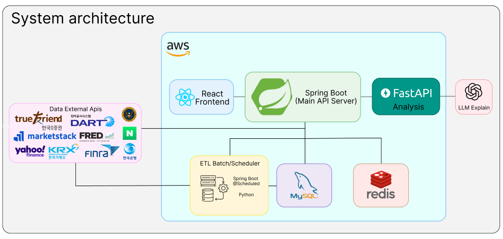
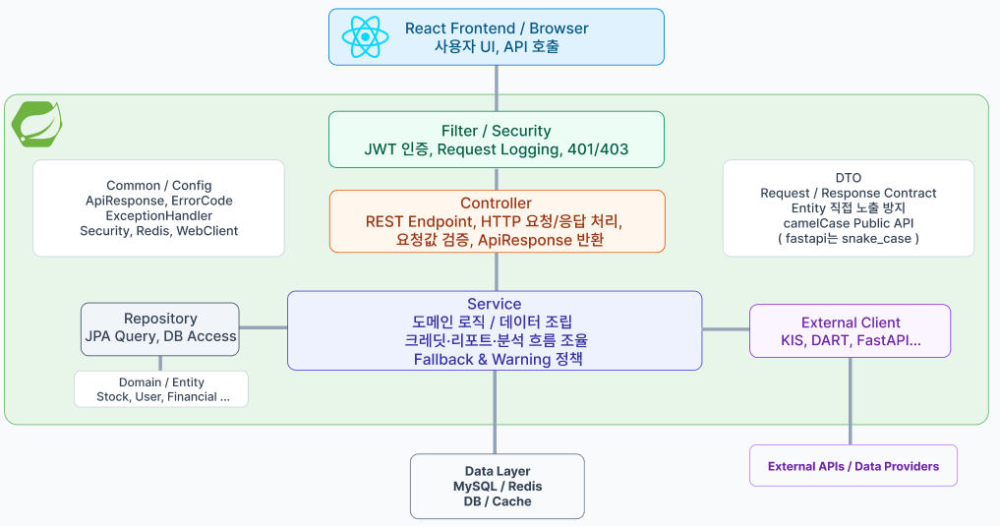

# QAIMA

### Quantitative Automated Investment Managed Assistant

QAIMA는 투자를 위한 흩어진 금융 정보들을 한 눈에 살펴보고 해석하기 힘들다는 문제점에서 시작되었습니다. 

이에 해당 문제를 해결하기 위해 데이터들을 종합적으로 수집하고 정제하여 사용자가 직관적으로 확인하고 

분석한 결과를 확인할 수 있도록 설계된 통합 분석 플랫폼입니다.

---

공식 프로젝트 종료일: **2026.07.03** · 문서 갱신일: **2026.09.30**<br>

---

현재 상태 
- 주요 기능 구현 완료 (25/09/15 ~ 26/06/30)
- 가배포 운영 완료 (26/07/01 ~ 26/08/31)
- 통합 QA 진행 중 (26/09/01 ~ )

---

[시연 영상](https://www.youtube.com/watch?app=desktop&v=0Dcm3MYKPsI&fbclid=PAT01DUAUppI1leHRuA2FlbQIxMABwZG9mAnNydGMGYXBwX2lkDzU2NzA2NzM0MzM1MjQyNwABp1mMZDmrp72zhSK6lf1GqYdNnQpZCVUo_UewBmu_MwXS0rPzCV8DFf8MiE6N_aem_HGQ2CRzbYGO8nGbg4J8Jew) <br><br>
[설치 및 실행](docs/local-setup.md) · [API 명세](docs/api/openapi.json) · [ERD](docs/erd/README.md) · [최신 QA 기록](tests/QA_PROGRESS_2026-09-28.md) <br><br>
[요구사항/기능/비기능 명세](https://atlantic-patch-55e.notion.site/Requirement-372c4ddb13128164ab7cc6a92b47833a?source=copy_link) <br><br>
[공개정책문서](https://brainy-aunt-af7.notion.site/QAIMA-3909bf21767a8059b134f315baf74c71?pvs=74) <br><br>
[예외처리 코드표](https://atlantic-patch-55e.notion.site/Error_Warning-372c4ddb13128168bb09cf872b74535d?pvs=74) <br><br>
[Design](https://www.figma.com/design/r66MrSuebxKz9MSil5P1uM/%EC%A1%B8%ED%94%84-%EA%B3%BD%EC%84%B1%ED%98%84?node-id=0-1&t=yMCk5XaqUyhByQIG-1) <br><br>
[개발기록](https://brainy-aunt-af7.notion.site/QAIMA-3eb9bf21767a809f8d8ac66344762409?source=copy_link)

---

## 1. 프로젝트 개요

## QAIMA는 어떤 플랫폼인가요?

QAIMA는 사용자가 투자에 대해 어려움을 느끼지 않도록

다음과 같은 기능을 제공합니다:

### 1. 기업 심층 분석
  - 기업의 재무·사업 데이터를 종합적으로 분석해 핵심 내용을 요약하고,
  - 수익성·성장성·안정성 등 주요 투자 지표를 한눈에 확인할 수 있도록 제공합니다.

### 2. 외부 요인 및 비교 분석

  - 기업의 가치는 내부 데이터만으로 결정되지 않습니다.
  - 금리·환율·시장 환경 등 외부 지표를 함께 분석하고, 유사한 특성을 가진 기업들을 클러스터링하여 비교 분석을 제공합니다.
  - 이를 통해 개별 기업의 성과뿐만 아니라 시장 내 상대적인 위치와 외부 환경에 따른 영향을 함께 파악할 수 있습니다.

### 3. 포트폴리오 분석 및 리밸런싱

  - 사용자가 보유한 종목과 비중을 입력하면 각 종목의 수익성과 리스크를 분석합니다.
  - 기업 분석과 외부 요인 분석 결과를 포트폴리오 단위로 종합하여
  - 자산 배분, 종목 집중도, 위험 수준 등 전체 포트폴리오의 상태를 진단합니다.

  - 이후 사용자의 투자 성향과 위험 선호도를 바탕으로 포트폴리오 조정이 필요한 부분을 제시하고, 리밸런싱 방향을 제공합니다.

### 4. 금융용어사전
  - 어렵고 복잡한 금융 용어들을 한눈에 확인하기 위한 기능입니다.
  - 해당 사전 기능은 각 기능 페이지와 연동되어, 그때그때마다 쉽게 찾아볼 수 있습니다.
---

## 2. 전체 구성



| 구성 | 담당하는 일 |
|---|---|
| React | 사용자 입력, 차트와 분석 결과 표시, 저장 리포트 조회, PDF 생성 |
| Spring Boot | 인증과 권한, 데이터 조회·조립, 크레딧 차감·환불, 사용자 정보와 리포트 저장 |
| FastAPI | 기술적 지표, 뉴스 감성, Peer Cluster, 포트폴리오 계산과 설명 생성 |
| MySQL | 종목·시세·재무·사용자·리포트 등 영속 데이터 저장 |
| Redis | 조회 결과와 분석 결과 재사용 |
| Python 배치·Spring 스케줄러 | 외부 금융 데이터 수집·정제·적재 |

주요 흐름은 브라우저가 Spring의 `/api/v1` API를 호출합니다. Spring이 필요한 데이터를 준비해 FastAPI에 전달하고, 분석 결과를 저장한 뒤 화면에 반환합니다.

공개 API와 React 타입은 `camelCase`, Spring과 FastAPI 사이의 분석 계약은 `snake_case`를 사용합니다. 
FastAPI의 성공 분석 payload를 공개 응답 형식으로 감싸는 책임은 Spring에 두었습니다.

- [OpenAPI JSON](docs/api/openapi.json)
- [정적 Swagger HTML](docs/api/index.html)

<details>
<summary>Spring Architecture</summary>



Controller는 요청과 응답을 다루고, Service는 데이터 조립과 분석 흐름을 담당합니다. 외부 제공처 호출은 Client, DB 접근은 Repository로 나눴습니다. 
WebFlux와 JPA를 함께 사용하며, 블로킹 작업을 분리하는 경로를 두고 있습니다.

</details>

## 3. 실행 화면

[시연 영상 참조](https://www.youtube.com/watch?app=desktop&v=0Dcm3MYKPsI&fbclid=PAT01DUAUppI1leHRuA2FlbQIxMABwZG9mAnNydGMGYXBwX2lkDzU2NzA2NzM0MzM1MjQyNwABp1mMZDmrp72zhSK6lf1GqYdNnQpZCVUo_UewBmu_MwXS0rPzCV8DFf8MiE6N_aem_HGQ2CRzbYGO8nGbg4J8Jew)

## 4. 주요 기능

### 4.1. Feature 1 — 종목 심층 분석

종목을 검색한 뒤 가격과 거래량, 재무 정보, 시장 스냅샷을 함께 확인합니다. 가격 차트에는 **EMA, Bollinger Band, Stochastic**을 계산해 표시하고, 선택한 기간의 데이터를 바탕으로 설명을 제공합니다.

종목 검색 → 가격·재무 조회 → 분석 기간 선택 → 분석 결과 확인 → 리포트 저장·PDF 순서로 사용할 수 있습니다. 관심종목에 추가한 종목은 다시 찾아보기 쉽도록 별도로 관리합니다.

### 4.2. Feature 2 — 외부 요인 분석

기업을 둘러싼 환경을 살펴보는 기능입니다. 산업 지수, 금리·환율·채권, 투자자 수급, 공매도와 관련 뉴스를 모아 종합적으로 확인합니다.

**Peer Cluster**에서는 다른 종목과의 상대 성과, 수익률 상관, 유동성·변동성 유사도, 선행·후행 관계를 비교합니다. 뉴스는 종목과 관련된 기사를 수집하고, 로컬 감성 모델로 부정·중립·긍정 확률을 계산합니다. 뉴스 감성 점수의 범위는 수집한 관련 기사 집합입니다.

여러 원천이 함께 들어오는 기능이라 일부 데이터만 없는 상황도 생깁니다. 정상적으로 확보한 결과를 유지하면서 부족한 항목을 경고로 안내한 뒤, 만약 장애가 발생한 부분은 부분 credit 환불합니다.

### 4.3. Feature 3 — 포트폴리오 분석

보유종목과 현금, 분석 기간, 위험 성향을 입력하면 현재 포트폴리오의 수익과 위험을 계산합니다. 자산별 변동성과 상관관계뿐 아니라 **각 종목이 전체 위험에 얼마나 기여하는지**도 확인할 수 있습니다.

| 비교 결과 | 의미 |
|---|---|
| 현재 포트폴리오 | 입력한 종목·현금 비중의 수익과 위험 |
| 최소분산 | 위험자산만으로 구성한 최소분산 포트폴리오 |
| 최대 샤프 | 위험자산만으로 구성한 최대 샤프 포트폴리오 |
| 위험배분 | 최대 샤프 위험자산 포트폴리오와 현금을 조합한 결과 |
| 효용 최대 | 현금·종목 비중 제약 안에서 효용을 직접 최대화한 결과 |

효율적 경계와 CAPM 결과를 함께 보여주고, 위험 성향과 현금 한도에 따라 결과가 어떻게 달라지는지 비교합니다. 재무·기술·뉴스·상관·산업 정보를 반영하는 **오버레이**도 제공합니다. 오버레이는 보조 관측에 따른 민감도 비교이며, 실제 매매를 지시하는 추천 비중으로 해석하지 않습니다.

### 4.4. Feature 4 — 경제·금융 용어 사전

금융 용어를 검색하고 정의와 공식 설명을 확인하는 기능입니다. 자동완성과 별칭 검색을 지원하며, 분석 화면과 설명문에서도 관련 용어를 찾아볼 수 있도록 연결했습니다.

### 4.5. 공통 기능

- 이메일 인증 기반 회원가입·로그인, Google·Kakao·Naver OAuth
- 내정보, 투자 지식 수준과 위험 성향 설정
- 관심종목, 기본 포트폴리오 저장
- 분석 비용 확인, 크레딧 사용 내역
- 분석 당시 요청·결과를 담은 리포트 저장과 재조회, PDF 내보내기
- 한국어·영어 화면과 설명 수준 선택

리포트는 분석 당시의 결과를 JSON snapshot으로 저장합니다. PDF는 화면에서 렌더링해 생성합니다. 사용자별 리포트에는 7일 보관·정리 로직이 있으므로 장기 보관할 자료는 PDF로 따로 보관하는 흐름입니다.

## 5. 데이터와 데이터베이스

| 출처·경로 | 프로젝트에서 사용하는 데이터 |
|---|---|
| KIS·Marketstack | 종목 정보, 가격·거래량 등의 조회·수집 경로 |
| OpenDART·SEC EDGAR | 기업 정보, 발행주식수, 미국 기관 보유 공시 등 |
| 한국은행 ECOS·FRED | 금리·채권·환율 등 거시 지표 |
| KRX·FINRA | 공매도 관련 데이터 |
| Yahoo Finance | 포트폴리오 계산용 수정종가 |
| Naver 뉴스·기사 원문 | 관련 뉴스와 감성 분석 입력 |
| CSV·수동 매핑 | 재무·공매도·용어 사전·종목 분류 보완 |

출처마다 지원 시장, 데이터 주기와 단위가 다릅니다. 특히 국내외 공매도처럼 서로 다른 의미의 데이터를 같은 비율로 취급하지 않도록 확인이 필요합니다. 위 표는 구현된 연동 경로이며, 모든 시장·기간의 데이터 수집이 완료됐다는 뜻은 아닙니다.

스키마 변경은 Flyway로 관리합니다. **V1~V51 기준 47개 테이블, 570개 컬럼, 41개 외래키**로 구성되어 있습니다.

[](docs/erd/overview.svg)

[영역별 상세 ERD](docs/erd/README.md) · [전체 ERD](docs/erd/full.svg) · [DBML 원본](docs/erd/qaima_flyway_v51.dbml)

Redis에는 조회·분석 결과를 저장해 재사용합니다. 최근 결과를 사용할지 새로 분석할지에 따라 원천 캐시 확인과 비용 계산이 달라집니다. 세부 규칙은 [캐시 정책](policy/cache_policy.md)과 [ETL 정책](policy/ETL_POLICY.md)에 정리했습니다.

## 6. 디렉터리 구조와 주요 기술

```text
qaima/
├── frontend/       # React 화면, API 연결, 차트·리포트·PDF
├── backend/        # Spring API, 인증, 데이터 조립, 저장·배치
├── analysis/       # FastAPI, 정량 계산, 뉴스 추론, 설명 생성
├── batch/          # Python 데이터 수집·적재 작업
├── sentiment_lab/  # 뉴스 감성 모델 전처리·학습·평가
├── data/           # CSV 입력과 분류·매핑 자료
├── docs/           # 아키텍처, API, ERD, 실행 안내
├── policy/         # 인증·계약·분석·캐시·ETL 정책
└── tests/          # 통합 QA, 격리 인프라 실행, 누적 기록
```

각 패키지의 단위·회귀 테스트는 해당 패키지의 `tests` 또는 `src/test`에 있습니다.

| 영역 | 주요 기술 | 상세 문서 |
|---|---|---|
| Frontend | React 19, TypeScript 5.9, Vite 7, Tailwind CSS 3, Axios, Lightweight Charts, i18next, jsPDF | [frontend](frontend/README.md) |
| Backend | Java 17, Spring Boot 3.2.5, WebFlux, Spring Security, JPA, Gradle 8.14 | [backend](backend/README.md) |
| Analysis | Python, FastAPI, Pydantic, NumPy, Pandas, SciPy, scikit-learn | [analysis](analysis/README.md) |
| 모델·설명 | PyTorch, Transformers, KF-DeBERTa 기반 감성 모델, Gemini·OpenAI 설명 클라이언트 | [sentiment_lab](sentiment_lab/README.md) |
| 저장·수집 | MySQL 8, Redis, Flyway, Python 배치·Spring 스케줄러 | [batch](batch/README.md) |

프론트의 정확한 의존성은 `package-lock.json`, Spring은 `build.gradle`을 기준으로 합니다. Python의 `requirements.txt`는 최소 버전 범위이며, QA 당시 설치 버전은 [분석 테스트 문서](analysis/tests/README.md)에 따로 남겼습니다.

## 7. 설치 및 실행

처음 실행한다면 **[로컬 실행 안내](docs/local-setup.md)** 순서대로 환경을 준비하면 됩니다. DB 생성, 로컬 설정 파일, 초기 데이터와 감성 모델 준비, Windows↔WSL 연결 확인까지 정리했습니다.

실행 순서는 **MySQL·Redis → WSL FastAPI → Windows Spring → Windows 프론트**입니다. 아래 명령은 실행 안내의 설정을 마친 뒤 사용하는 요약입니다.

**7.1. 저장소 복제 — Windows PowerShell**

```powershell
git clone https://github.com/joony0905/KNU_SW_QAIMA_GraduationProject.git qaima
cd qaima
```

**7.2. 분석 서버 — WSL, 프로젝트 루트 기준**

```bash
cd analysis
../.venv_wsl/bin/python -m uvicorn app.main:app --host 0.0.0.0 --port 8000
```

**7.3. API 서버 — Windows PowerShell, 프로젝트 루트 기준**

```powershell
cd backend
$env:SPRING_CONFIG_ADDITIONAL_LOCATION = "file:C:/qaima-local/"
.\gradlew.bat bootRun --args="--spring.profiles.active=mysql,local"
```

**7.4. 프론트엔드 — 새 Windows PowerShell, 프로젝트 루트 기준**

```powershell
cd frontend
npm ci
npm run dev -- --port 5173 --strictPort
```

브라우저에서 `http://localhost:5173`에 접속합니다. 외부 API 자격증명, 이메일 설정, 종목·가격 데이터와 감성 모델 가중치는 별도로 준비해야 합니다. 현재 저장소에는 전체 기능을 채우는 단일 초기화 명령이나 무키 데모 모드가 없습니다.

## 8. 테스트와 현재 남은 문제

계산 단위 테스트에서 시작해 API 계약, 실제 SQL, Redis 장애, Spring↔FastAPI 통신, 브라우저와 저장 리포트까지 검증 범위를 넓혔습니다. (진행중)

| 검증 범위 | 확인한 내용과 남은 문제 |
|---|---|
| 정량 계산 | 지표·공분산·CAPM·효용·최적화 제약의 독립 기대값 비교. 실제 시장에서의 예측 성능은 별도 평가 필요 |
| 서버·저장소 | 격리 MySQL·Redis와 실제 계산 서버를 연결해 차감·환불·snapshot 대조. 일부 SQL 오류·입력 준비 실패의 환불 누락 |
| Feature 2 | 원천·모델·캐시의 단일·복수 장애와 복구 확인. 정상 데이터 연쇄 누락, 오류 캐시 잔류, 경고·화면 전달 문제 |
| 브라우저·PDF | 실제 화면·차트·리포트 재조회·PDF 확인. 일부 응답 경합, 저장 결과·경고 누락, PDF 스타일 문제 |
| 인증·배치 | 실제 HTTP·SQL 동시성 검사. 토큰 경합, 일부 계정 상태 처리, 적재 rollback·잠금 문제 |

실제 DB·Redis·로컬 모델을 사용한 검사도 외부 금융 제공처나 유료 LLM 호출을 대체한 경우가 있습니다. 무엇을 실제로 실행했고 무엇을 대체했는지는 각 테스트 문서에서 확인할 수 있습니다. 전체 외부 연동과 모든 사용자 흐름의 검증은 진행 중입니다.

- [최신 QA 인덱스](tests/README.md) · [누적 결과와 남은 범위](tests/QA_PROGRESS_2026-09-28.md)
- [장애·fallback 검증](tests/FALLBACK_QA_HANDOFF.md)
- [Spring 테스트](backend/src/test/README.md) · [FastAPI 테스트](analysis/tests/README.md)
- [프론트 테스트](frontend/tests/README.md) · [배치 테스트](batch/tests/README.md) · [모델 실험 테스트](sentiment_lab/tests/README.md)

테스트 실행 명령은 [로컬 실행 안내의 테스트 항목](docs/local-setup.md#9-테스트)에 모았습니다. 초기 검증 문서의 9월 25일 수치와 최신 추가 QA 수치는 따로 읽어야 합니다.

## 9. 상세 문서

| 내용 | 문서 |
|---|---|
| 처음 실행하기 | [환경·설정·초기 데이터·모델 준비](docs/local-setup.md) |
| 설계와 기능 흐름 | [아키텍처](docs/architecture.md), [기능별 설명](docs/features.md) |
| API | [OpenAPI JSON](docs/api/openapi.json), [정적 Swagger HTML](docs/api/index.html) |
| 데이터베이스 | [ERD 안내](docs/erd/README.md), [Flyway 원본](backend/src/main/resources/db/migration) |
| 설계 정책 | [정책 인덱스](policy/README.md), [LLM 설명 정책](policy/LLM_explain_policy.md) |
| 검증 이력 | [초기 검증 결과](docs/verification.md), [요구사항 추적표](docs/traceability.md), [최신 추가 QA](tests/QA_PROGRESS_2026-09-28.md) |

GitHub에서는 Swagger HTML이 소스로 표시됩니다. 실행 중인 Spring의 `http://localhost:8080/swagger-ui/index.html`에서 대화형 명세를 확인할 수 있습니다.

## 10. 향후 보완

- 여러 원천을 조립하는 과정에서 정상 결과와 경고가 끝까지 보존되도록 개선
- 분석 실패·취소·재시도에 따른 차감과 환불 경계 정리
- 화면 응답 경합과 저장 리포트·PDF 표시 문제 보완
- 실제 금융 제공처 연동, 기간·시장별 데이터 품질, 뉴스 감성 모델 평가 확대
- 새 환경에서의 초기 데이터 준비와 설치 재현성 개선

졸업프로젝트의 범위는 Feature 1~4와 공통 기능입니다. Harness·Connector·Validator 등의 후속 확장은 별도 범위로 관리합니다.

## 11. 개발팀

| 이름 | 담당 |
|---|---|
| 송예준 | 총괄 |
| 이은규 | 백엔드 |
| 곽성현 | 프론트엔드 |

프로젝트 코드는 [Apache License 2.0](LICENSE)을 따릅니다. 외부 금융 데이터, 모델과 학습 자료의 이용 조건은 각 제공처의 정책을 따릅니다. 
감성 모델과 학습 데이터의 출처는 [sentiment_lab 문서](sentiment_lab/README.md)에 정리되어 있습니다.
