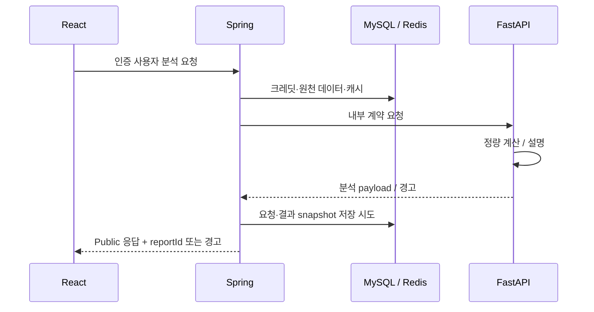

# QAIMA 아키텍처와 책임 경계

작성·검증일: 2026-09-25. 프로젝트 종료일: 2026-07-03. `reference.md`는 의도된 명세, 현재 소스와 실행 결과는 구현·검증의 근거로 사용합니다.

## 시스템 경계

| 경계 | 실제 구현 위치 | 책임 |
|---|---|---|
| 브라우저→Spring | `frontend/src/api/apiClient.ts`, `endpoints.ts` | `/api/v1`, access token·refresh cookie·언어 헤더 |
| Public HTTP | `backend/src/main/java/com/qaima/api/` | 파라미터·인증 사용자·API envelope |
| Spring→FastAPI | `external/FastApiAnalysisClient.java`, 내부 DTO | `/feature1/analysis`, `/feature2/analysis`, `/feature3/analysis`, snake_case 변환 |
| FastAPI→Spring | `analysis/app/services/market_data_spring.py`, `feature3_price_data.py`, `feature3_benchmark_data.py` | peer 데이터 pack·가격·벤치마크 취득 |
| 분석 | `analysis/app/api/`, `models/`, `services/` | 입력 계약, 수치 계산, 설명 |
| 저장 | Spring `domain/`, `repository/` | MySQL 사용자·가격·재무·리포트·크레딧 등 |
| 캐시 | Spring Redis 관련 service/config | 조회·분석 재사용. 경로별 장애 격리 검증 필요 |
| 적재 | `batch/jobs/`, Spring sync service·scheduler | 외부 데이터 수집·정제·병합 |
| 모델 실험 | `sentiment_lab/` | 운영 추론과 분리한 전처리·학습·평가 |

Spring은 WebFlux와 JPA를 함께 사용합니다. `Blocking` 유틸이 블로킹 호출을 분리하는 주요 경로이며, 모든 Repository 접근의 스레드 적합성을 검증했다는 뜻은 아닙니다.

## 요청·저장 흐름

Feature별 예외·환불·저장 경계가 다르므로 이 그림만으로 동일한 트랜잭션이나 실패 정책을 가정하지 않습니다. Feature 1 Controller의 분석 실패 환불 및 리포트 실패 경고 경로부터 테스트를 추가하고 있습니다.

리포트는 JSON snapshot이며 브라우저에서 재렌더링하여 PDF로 내보냅니다. `AnalysisReportService`는 조회 시에도 사용자별 7일 이전 자료 정리를 호출합니다. 조회 API를 무조건 무변경 작업으로 취급할 수 없습니다.

## 계약

Public API는 camelCase, 내부 분석 wire는 snake_case입니다. 다만 class별 Jackson annotation과 ObjectMapper 설정이 실제 이름을 결정하므로 전역 이름 변경으로 처리하지 않습니다. FastAPI의 성공 분석 payload와 `main.py`의 실패 envelope는 구분합니다.

Swagger 정적 명세의 123개 작업은 reflection으로 현재 Controller의 HTTP method/path 집합과 일치함을 확인했습니다. 응답 schema 일치와 Service·Repository 실행 결과는 별도 검증 대상입니다. [작업별 추적표](../backend/src/test/swagger-coverage.md)를 참조합니다.

## 실행 환경

Spring·React는 Windows, FastAPI는 WSL입니다. 현재 환경에서 Windows DB·Redis 포트는 열려 있고 WSL의 루프백으로는 접속이 거절되었습니다. WSL 게이트웨이로는 TCP 접근이 가능했습니다. Windows Java의 YAML 기반 MySQL read-only SELECT 1 및 Redis PING 검사는 통과했습니다. 이것은 앱 전체 기동·테이블 정합성·외부 제공처 연동 검증과 별개입니다.

별도 격리 실행에서는 Windows의 실제 Spring 분석 client→WSL 임시 uvicorn TCP11개가 통과했습니다. F1/F3 실제 계산, F2 빈키 경고, 로컬 감성 모델과 F3 Public handler의 보고서/환불 호출까지 확인했습니다. 가격·저장소·크레딧/보고서는 합성 경계이며 전체 Spring 부팅이나 실제 원장 저장까지의 증거는 아닙니다. 임시 토큰과 외부송신/.env 읽기 차단을 적용하고 서버 종료/실행 XML을 확인했습니다. [실행 상세](../backend/src/test/cross-os-fastapi.md).

설정·비밀값은 YAML과 로컬 환경에서 읽되 공개 문서에는 값·운영 주소·토큰·계정정보를 기록하지 않습니다. 테스트 빌드에 복사된 설정과 내부 로그는 `.runtime`에 두고 Git에서 제외합니다.

## 기존 자료 재사용 범위

기존 `policy/README.md`와 `docs/architecture_flow/feature1_flow_json`~`feature4_flow_json`의 발표 노트·흐름 자료를 구현 탐색에 활용했습니다. `extension_flow_json`의 후속 하네스 설계는 이번 졸업프로젝트 구현·완료 범위에 포함하지 않습니다. 오래된 그림·발표 노트의 수치나 지원 범위는 현재 코드 확인 없이 검증 사실로 재사용하지 않습니다.
