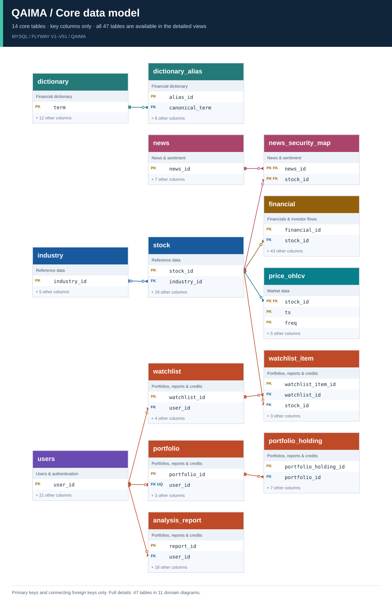

# QAIMA ERD

Flyway **V1~V51** 기준으로 만든 SVG입니다. 전체 스키마는 **47개 테이블 · 570개 컬럼 · 41개 외래키**이며, 영역별 상세도 11개와 요약도·전체도를 제공합니다.

## 바로 보기

- [README용 요약도](overview.svg): 핵심 테이블 14개와 연결에 필요한 키 컬럼
- [전체 ERD](full.svg): 47개 테이블의 모든 컬럼과 41개 외래키
- [DBML 원본](qaima_flyway_v51.dbml): 기본값, 인덱스 정의, ENUM 값, FK 동작, 한글 설명
- [Flyway 마이그레이션](../../backend/src/main/resources/db/migration): 스키마 정의 원본

전체도는 확대 열람용입니다. 상세 내용을 읽을 때는 아래 영역별 SVG를 선택하세요. SVG를 다운로드해 브라우저에서 열면 확대해 읽을 수 있습니다.

## 요약도



요약도는 핵심 테이블 14개, 해당 테이블 사이의 FK 12개를 표시합니다. 생략된 테이블·컬럼·관계는 전체도와 영역별 상세도에서 확인할 수 있습니다.

## 영역별 상세 ERD

각 상세도에는 해당 영역의 **모든 컬럼**을 표시합니다. 영역 밖의 부모 테이블은 회색의 **PK만 표시한 참조 카드**로 추가했습니다. FK는 자식 테이블이 속한 영역에 표시하며, 외부 테이블에서 들어오는 관계는 그 외부 테이블의 영역에서 확인합니다.

| 영역 | 소속 테이블 | 소속 컬럼 | 외부 참조 카드 | FK | SVG |
|---|---:|---:|---:|---:|---|
| 종목 기준정보 | 6 | 51 | 0 | 8 | [보기](01-reference.svg) |
| 시세·기술지표·시장 스냅샷 | 5 | 55 | 1 | 4 | [보기](02-market_data.svg) |
| 재무·발행주식·공매도·투자자 수급 | 5 | 131 | 1 | 4 | [보기](03-financials_and_flows.svg) |
| 금리·채권·환율 | 3 | 46 | 0 | 0 | [보기](04-macro.svg) |
| 산업 지수·비교 캐시 | 4 | 21 | 1 | 4 | [보기](05-industry_comparison.svg) |
| 뉴스·감성 분석 | 5 | 45 | 2 | 6 | [보기](06-news_and_sentiment.svg) |
| SEC 13F 기관 보유 데이터 | 4 | 70 | 1 | 3 | [보기](07-sec_13f.svg) |
| 사용자·인증 | 5 | 52 | 0 | 4 | [보기](08-users_and_auth.svg) |
| 포트폴리오·관심종목·리포트·크레딧 | 6 | 55 | 2 | 7 | [보기](09-user_features.svg) |
| 금융 용어 사전 | 2 | 21 | 0 | 1 | [보기](10-dictionary.svg) |
| 인증·API 요청 로그 | 2 | 23 | 0 | 0 | [보기](11-logs.svg) |
| **합계** | **47** | **570** | 중복 참조 포함 | **41** | [전체](full.svg) |

외부 참조 카드는 다른 영역의 테이블을 다시 표시한 것이며, 47개 테이블 합계에 중복 계산하지 않습니다.

## 표기 읽는 법

| 표시 | 의미 |
|---|---|
| `PK` | 기본키. 여러 행에 표시되면 복합 기본키의 구성 컬럼 |
| `FK` | 실제 Flyway에 선언된 외래키 컬럼 |
| `UQ` | 단일 컬럼 유니크 인덱스. 접두 인덱스는 하단 `PREFIX` 설명 함께 확인 |
| 하단 `UQ (...)` | 여러 컬럼의 조합에 적용되는 유니크 제약 |
| `AI` | `AUTO_INCREMENT` |
| 타입 뒤 `?` | `NULL` 허용. `?`가 없으면 `NOT NULL` |
| `enum(n)` | 값이 n개인 SQL ENUM. 실제 값은 DBML 참조 |
| 회색 카드 | 해당 상세도 밖의 부모 테이블. PK만 표시 |
| `EXPLICIT INDEXES` | PK를 제외하고 마이그레이션에 명시된 인덱스 수 |

관계선 끝의 두 막대는 정확히 1개, 원과 막대는 0~1개, 원과 갈라진 선은 0~여러 개를 의미합니다. 선은 참조되는 키와 해당 FK 컬럼 행을 연결합니다.

### 스키마 해석 시 참고

- 관계선은 DB에 선언된 FK만 표시합니다. `portfolio_holding.stock_code`, `analysis_report.stock_code`, 로그의 `user_id` 등에는 추정 관계선을 추가하지 않았습니다.
- `portfolio.user_id`와 `stock_realtime_cache.stock_id`의 유일성을 관계 기호에 반영했습니다.
- `news.url(255)`는 앞 255자의 유니크 접두 인덱스이며, `news_sentiment_observation`의 `title(191)`은 일반 복합 인덱스의 접두 컬럼입니다. 뉴스 상세도와 전체도에 별도로 표시했습니다.
- 기본값, 일반 인덱스의 구성과 이름, ENUM 값, 삭제·갱신 동작의 세부 정의는 DBML에서 확인할 수 있습니다.
- 영역 색상은 문서 분류입니다. 데이터 수집 순서나 서비스 호출 흐름을 뜻하지 않습니다.

## 최상위 README에 붙여넣기

아래 예시는 저장소 루트의 `README.md` 기준 상대 경로입니다.

```markdown
## 데이터베이스 설계

Flyway V1~V51 기준: 47개 테이블 · 570개 컬럼 · 41개 외래키

[](docs/erd/overview.svg)

- [영역별 상세 ERD](docs/erd/README.md)
- [전체 ERD](docs/erd/full.svg)
- [DBML 원본](docs/erd/qaima_flyway_v51.dbml)
```

## 생성 기준과 검증

- 작성일: 2026-09-30
- 입력: `docs/erd/qaima_flyway_v51.dbml`의 테이블·컬럼·인덱스·FK·TableGroup
- 생성: DBML 파싱 후 Graphviz로 배치하고 SVG로 출력
- SVG는 글자·도형·선으로 구성한 벡터 파일이며, 외부 이미지·스크립트·외부 폰트 다운로드가 필요하지 않습니다.
- SVG 13개의 브라우저 렌더링을 확인하고, 텍스트가 테이블 밖으로 벗어나는지와 테이블끼리 겹치는지 검사했습니다. 두 검사 모두 0건입니다.
- 전체도의 테이블·컬럼·FK를 원본과 대조했습니다. 11개 상세도의 소속 테이블·컬럼·FK 합계도 각각 47·570·41입니다.
- 원본 DBML이 변경되면 SVG도 다시 생성해야 합니다.

생성 시점 DBML SHA-256:

```text
dae40ea7288944f0b228c0cd0f99632ba492ca97fe199d63e7e91066ad572a3d
```
