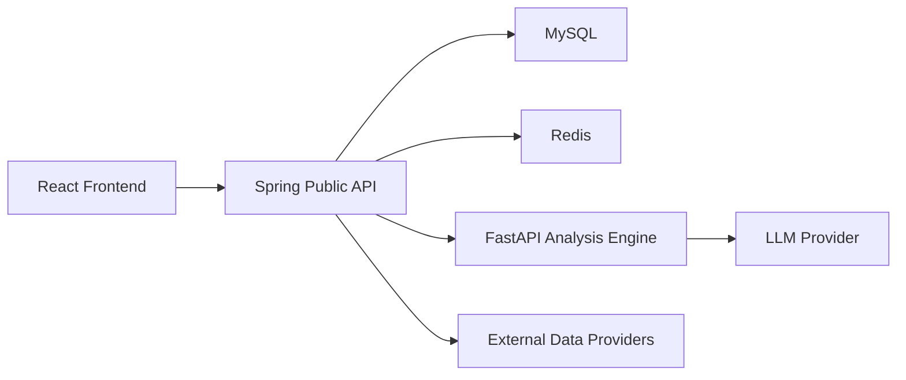
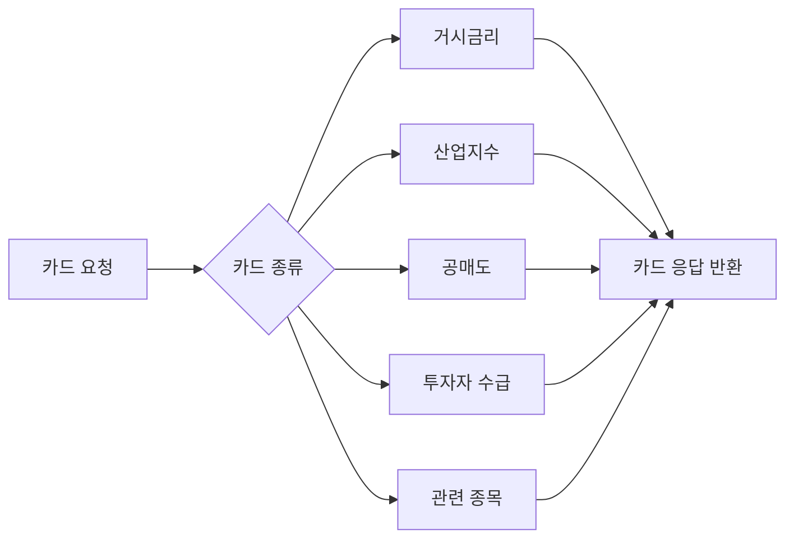
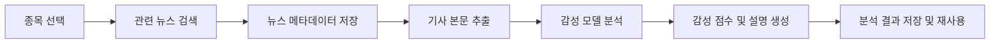
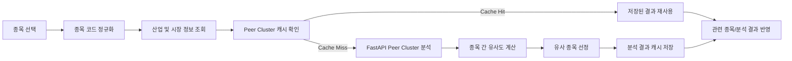
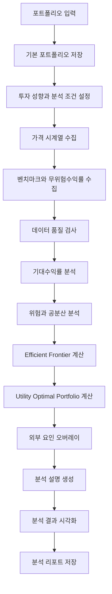
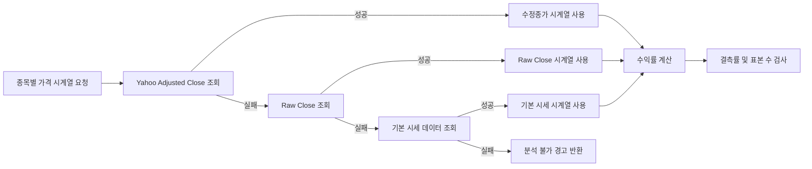

# QAIMA 정책 문서

## 0. 문서 목적과 공개 범위

이 문서는 QAIMA의 핵심 정책을 공개/공유 가능한 수준으로 요약한 문서다.

원문 정책과 내부 운영 기록은 제외하였다.

### 공개본 포함 범위

| 구분 | 포함 여부 | 설명 |
|---|---:|---|
| 시스템 아키텍처 | 포함 | React, Spring, FastAPI, MySQL, Redis 책임 경계 |
| API/DTO 계약 정책 | 포함 | public API, 내부 API, naming, breaking change 기준 |
| Feature1/2/3 분석 흐름 | 포함 | 사용자 기능, 입력, 처리, 출력, fallback |
| Error/Warning 정책 | 포함 | 실패와 부분 성공 처리 기준 |
| Redis/ETL/LLM/리포트 정책 | 포함 | 운영 원칙 중심 요약 |
| 실제 Secret/API Key/Token | 제외 | 공개 문서에 포함하지 않음 |
| EC2 IP/SSH/PEM 경로 | 제외 | 내부 운영 문서에서만 관리 |
| 상세 SQL/배포 명령어 | 제외 | 내부 runbook에서만 관리 |
| 일회성 장애 기록 | 제외 | 운영 회고 또는 내부 runbook으로 분리 |

---

## 1. 시스템 아키텍처와 책임 경계

QAIMA는 React, Spring Boot, FastAPI, MySQL, Redis를 분리해 운영한다.



### 계층별 책임

| 계층 | 주요 책임 | 외부 노출 |
|---|---|---|
| React | 사용자 입력, 화면 렌더링, public API 호출 | 사용자 화면 |
| Spring Public API | 인증, 권한, 크레딧, DB/외부 데이터 조회, 응답 envelope | `/api/v1/**` |
| Spring Internal DTO | FastAPI 요청/응답 변환 | 내부 |
| FastAPI | 분석 계산, 포트폴리오 수학, LLM 설명 생성 | Spring 내부 |
| MySQL | 영속 데이터 저장 | 내부 DB |
| Redis | 단기 캐시, 성능 보조 계층 | 내부 캐시 |

### Naming 규칙

| 영역 | Naming |
|---|---|
| DB | `snake_case` |
| Spring public DTO | `camelCase` |
| React type/mapper | `camelCase` |
| FastAPI/Pydantic | `snake_case` |
| Redis key | `colon-separated:key` |
| Error/Warning code | `UPPER_SNAKE_CASE` |

Frontend는 Spring public API만 호출한다. FastAPI는 브라우저에 직접 노출하지 않고, Spring이 내부 분석 요청을 조립해 호출한다.

---

## 2. API/DTO 계약 정책

QAIMA의 API 계약은 네 계층으로 나뉜다.

| 계약 경계 | 위치 | 변경 위험 | 정책 |
|---|---|---:|---|
| Spring Public API | `/api/v1/**` | 높음 | 호환성 유지 우선 |
| Spring to FastAPI | external/internal DTO | 중간 | snake_case wire 계약 |
| FastAPI Model | Pydantic model | 중간 | payload-only 응답 |
| React Type/Mapper | frontend type/mapper | 높음 | public API 기준 |

### Public API 원칙

- public 응답은 `ApiResponse` envelope를 유지한다.
- Spring public field는 `camelCase`를 사용한다.
- FastAPI 응답을 public API로 그대로 흘려보내지 않는다.
- Spring이 내부 분석 결과를 public contract에 맞게 변환한다.
- 기존 route, field, enum 의미는 명시적 승인 없이 변경하지 않는다.

### Additive 변경

다음 변경은 기본적으로 호환 변경으로 본다.

- optional field 추가
- nullable section 추가
- warning code 추가
- diagnostics/policy echo 같은 비필수 정보 추가
- locale 또는 표시용 metadata 추가

### Breaking 변경

다음 변경은 breaking change로 본다.

- public route 변경 또는 제거
- public field 삭제
- field 의미 변경
- type 변경
- enum 값 제거
- HTTP status 또는 error semantics 변경

breaking change가 필요하면 새 route, dual-read, migration 계획, 제거 일정을 함께 둔다.

### 계약 변경 체크리스트

```text
[ ] Public route/method/status 변경 여부 확인
[ ] DTO field 추가/삭제/의미 변경 여부 확인
[ ] React type/mapper 영향 확인
[ ] FastAPI model과 Spring external DTO 경계 확인
[ ] warning/error code 추가 여부 확인
[ ] i18n 메시지 추가 여부 확인
[ ] 기존 저장 리포트 재조회 호환성 확인
[ ] golden JSON fixture 또는 수동 payload 예시 갱신
```

---

## 3. 인증 및 사용자 정책

QAIMA 인증은 일반 로그인, 이메일 선인증 회원가입, OAuth 추가정보 입력, refresh cookie 구조를 기준으로 한다.

### 인증 상태 모델

| 상태 | 의미 | 사용 가능 기능 |
|---|---|---|
| anonymous | 비로그인 | 공개 화면, 일부 조회 |
| authenticated | 로그인 완료 | 분석, 저장, 리포트, 관심목록 |
| email_unverified | 이메일 인증 전 | 가입/로그인 제한 |
| profile_required | OAuth 추가정보 필요 | 추가정보 입력 화면 |
| locked/disabled | 제한 계정 | 로그인/분석 제한 |

### 주요 원칙

- 일반 회원가입은 이메일 선인증 후 계정을 생성한다.
- 비밀번호는 hash로 저장한다.
- access token은 짧은 수명을 가진다.
- refresh token은 httpOnly cookie로 관리한다.
- OAuth 첫 가입 시 필수 정보가 부족하면 `profile_required` 상태로 둔다.
- 아이디 찾기와 인증 실패 응답은 개인정보를 과도하게 노출하지 않는다.

---

## 4. Feature1 정책 - 종목 기본 분석

Feature1은 단일 종목의 가격 흐름, 재무제표, 시장 스냅샷, 보조지표를 기반으로 기본 분석 리포트를 생성한다.

### 요약

| 항목 | 내용 |
|---|---|
| 사용자 기능 | 종목 검색, 차트 확인, 재무제표 확인, 분석 리포트 생성 |
| 주요 입력 | 종목 코드, 차트 기간, 재무 데이터, 시장 스냅샷 |
| 주요 처리 | 가격 데이터 조회, 보조지표 계산, 재무 흐름 분석, LLM 설명 |
| 주요 출력 | 가격 흐름 요약, 재무 타임라인, 보조지표, 분석 설명 |
| 실패/Fallback | 외부 가격 provider fallback, LLM 실패 시 결정론적 설명 |
| 저장/캐시 | 분석 결과 리포트 snapshot 저장 |

### 처리 흐름


---

## 5. Feature2 정책 - 외부 요인 분석

Feature2는 종목을 둘러싼 거시환경, 산업지수, 공매도, 수급, 관련 종목, 뉴스 감성을 분석한다.

### 요약

| 항목 | 내용 |
|---|---|
| 사용자 기능 | 외부 요인 카드 조회, 뉴스 감성, Peer Cluster, 종합 분석 |
| 주요 입력 | 종목 코드, 분석 기간, 카드 옵션 |
| 주요 처리 | 매크로 데이터 조회, 산업/수급/공매도 분석, 뉴스 감성 분석 |
| 주요 출력 | 카드 데이터, 시계열, peer cluster, 뉴스 감성, 종합 설명 |
| 실패/Fallback | 일부 데이터 누락 시 부분 성공과 warning 반환 |
| 저장/캐시 | 뉴스 감성, peer cluster, 카드성 데이터 Redis 캐시 |

### 카드 흐름



### 뉴스 감성 흐름



### Peer Cluster 흐름



---

## 6. Feature3 정책 - 포트폴리오 분석

Feature3은 사용자가 입력한 포트폴리오를 기반으로 기대수익률, 위험, 자산 간 상관관계, 위험 기여도, 효용을 분석한다.

분석 결과는 Efficient Frontier와 여러 유형의 포트폴리오로 시각화되며, 사용자의 투자 수준과 위험 회피 성향을 반영한 설명을 제공한다.

### 요약

| 항목 | 내용 |
|---|---|
| 사용자 기능 | 포트폴리오 입력/저장, 위험 분석, 효율적 포트폴리오 비교 |
| 주요 입력 | 보유 종목, 수량, 평단가, 현금, 투자성향 |
| 주요 처리 | 가격 시계열 수집, 수익률 계산, 공분산/상관관계 분석, 최적화 |
| 주요 출력 | 현재 포트폴리오, 위험 기여도, Efficient Frontier, Utility Optimal |
| 실패/Fallback | adjusted close 실패 시 raw close 또는 기본 시세 fallback |
| 저장/캐시 | 기본 포트폴리오, 분석 리포트, overlay cache preview |

### 전체 처리 흐름



### 가격 데이터 처리

수정종가는 국내/해외 데이터 소스별 제공 방식이 달라 일관된 처리를 위해 Yahoo Finance의 Adjusted Close를 우선 사용한다.



fallback이 발생하면 실제 사용한 가격 데이터 종류, 제공처, 결측률, 표본 수, 데이터 품질 warning을 분석 결과에 포함한다.

### 포트폴리오 위험

포트폴리오 변동성은 투자 비중 벡터와 수익률 공분산 행렬을 사용해 계산한다.

$$
\sigma_p = \sqrt{\mathbf{w}^{T} \Sigma \mathbf{w}}
$$

- $\sigma_p$: 포트폴리오 변동성
- $\mathbf{w}$: 자산별 투자 비중 벡터
- $\Sigma$: 자산 수익률의 공분산 행렬
- $\mathbf{w}^{T}$: 투자 비중 벡터의 전치

### Utility Optimal Portfolio

평균-분산 효용함수는 다음과 같이 표현한다.

$$
U = E(R_p) - \frac{A}{2}\sigma_p^2
$$

- $E(R_p)$: 포트폴리오 기대수익률
- $A$: 사용자 위험회피계수
- $\sigma_p^2$: 포트폴리오 분산

위험회피계수가 높을수록 변동성이 낮은 포트폴리오가 높은 효용을 갖고, 위험회피계수가 낮을수록 기대수익률의 비중이 커진다.

---

## 7. Error / Warning / Frontend Message 정책

QAIMA는 “실패”와 “부분 성공”을 구분한다.

| 구분 | 의미 | 처리 |
|---|---|---|
| Error | 요청 자체를 완료할 수 없음 | HTTP error 또는 실패 envelope |
| Warning | 핵심 처리는 성공했으나 일부 데이터/설명이 누락됨 | 성공 응답의 `meta.warnings` |
| Frontend message | 사용자에게 보여줄 문구 | error/warning code 기반 매핑 |

### 원칙

- 분석 계산이 성공했지만 리포트 저장만 실패하면 분석 결과는 반환한다.
- LLM 설명 생성만 실패하면 계산 결과를 유지하고 deterministic 설명을 사용할 수 있다.
- 외부 데이터 일부가 없으면 가능한 경우 부분 성공으로 처리한다.
- 사용자에게 내부 provider명, raw exception, secret, stack trace를 노출하지 않는다.
- warning code는 프론트 메시지 매핑과 함께 관리한다.

---

## 8. Redis 캐시 정책

Redis는 영속 저장소가 아니라 성능 계층이다. Redis 장애는 가능한 경우 전체 기능 장애로 전파하지 않고 DB 또는 외부 API fallback을 사용한다.

### 캐시 원칙

- Redis key는 기능 prefix와 version을 포함한다.
- payload에는 secret, token, password, raw HTML 전문, 불필요한 개인정보를 넣지 않는다.
- read 실패는 가능한 경우 fallback으로 처리한다.
- write 실패는 핵심 응답을 막지 않는다.
- 운영 삭제는 prefix/version 단위로 제한하며, 대량 삭제는 SCAN 기반으로 수행한다.

### 대표 캐시 대상

| 대상 | 목적 |
|---|---|
| 특징주 랭킹 | 반복 호출 완화 |
| 실시간 가격/스냅샷 | 외부 API 호출 감소 |
| Feature2 peer cluster | 분석 비용 감소 |
| Feature2 뉴스 감성 | 기사/모델 분석 재사용 |
| Feature3 overlay preview | 분석 전 비용/캐시 상태 확인 |

---

## 9. ETL / Scheduler / 시간축 정책

ETL과 스케줄러는 외부 데이터 provider의 시간축과 시장 일정을 고려해 idempotent하게 동작해야 한다.

### 원칙

- batch는 재실행 가능해야 한다.
- unique key 또는 upsert 기준을 명확히 둔다.
- 외부 API quota와 rate limit을 고려한다.
- scheduler와 수동 batch가 같은 데이터를 동시에 갱신하지 않도록 한다.
- 실패 대상과 실패 사유는 재처리 가능하게 기록한다.
- 일봉 데이터는 거래일 기준 canonical timestamp를 유지한다.

### 주요 데이터

| 데이터 | 사용처 |
|---|---|
| price OHLCV | Feature1 차트, Feature3 수익률 |
| financial | Feature1 재무 분석, Feature3 overlay |
| short selling | Feature2 공매도 |
| investor flow | Feature2 수급 |
| industry index OHLCV | Feature2 산업지수, peer cluster |
| base rate / bond yield / exchange rate | Feature2 거시환경 |
| issued shares | 시장 스냅샷, valuation 보조 |

---

## 10. LLM / Prompt 정책

LLM은 계산 결과를 바꾸는 주체가 아니라 계산된 데이터를 설명하는 계층이다.

### 원칙

- LLM은 정량 계산 결과를 변경하지 않는다.
- prompt는 JSON-only 출력을 요구한다.
- 가능한 경우 provider의 structured output 기능을 사용한다.
- JSON parse 실패 시 잘못된 응답을 구조화된 데이터처럼 통과시키지 않는다.
- LLM 실패는 warning으로 처리하고 deterministic 설명으로 fallback할 수 있다.
- 투자 수준은 설명 난이도와 용어 밀도만 조절한다.
- 직접적인 매수/매도 권유 표현은 피한다.

### 투자 수준별 설명 톤

| 수준 | 설명 방향 |
|---|---|
| BEGINNER | 쉬운 표현, 용어 풀이 중심 |
| INTERMEDIATE | 주요 지표 의미와 흐름 설명 |
| ADVANCED | 상충 신호와 리스크 해석 |
| EXPERT | 가정, 민감도, 팩터, 계량 관점 압축 설명 |

---

## 11. 분석 리포트 / PDF / 보관 정책

분석 결과는 리포트 snapshot으로 저장하고, PDF는 저장된 JSON snapshot을 다시 렌더링해 생성한다.

### 원칙

- 분석 성공 후 리포트 저장을 시도한다.
- 저장 성공 시 `meta.reportId`를 반환한다.
- 저장 실패는 분석 실패가 아니며 warning으로 처리한다.
- PDF 바이너리는 필수 저장 대상이 아니다.
- 리포트 상세 조회는 본인 소유 리포트만 허용한다.
- 권한 없음과 미존재는 사용자에게 과도하게 구분해 노출하지 않는다.

### 리포트 포함 정보

- 분석 대상 종목 또는 포트폴리오
- 분석 기간과 데이터 기준
- 사용 모델과 provider
- 분석 결과 snapshot
- warning 목록
- 사용자 투자 수준
- 생성 시각

---

## 12. 운영 원칙 요약

상세 배포 명령어, 서버 접속 정보, 환경변수, SQL 진단문은 내부 runbook에서 관리한다. 공개 정책 문서에는 운영 원칙만 남긴다.

### 배포 전 확인

```text
[ ] DB migration 영향 확인
[ ] backend build/compile 확인
[ ] frontend build 확인
[ ] FastAPI analysis health 확인
[ ] Redis 연결 확인
[ ] OAuth redirect URI 확인
[ ] 외부 API key 누락 여부 확인
[ ] scheduler enabled 여부 확인
```

### 배포 후 smoke test

| 영역 | 확인 |
|---|---|
| Auth | 회원가입, 로그인, refresh, OAuth |
| Feature1 | 종목 검색, 차트, 분석, 리포트 |
| Feature2 | 카드 데이터, 뉴스, peer cluster, 종합 분석 |
| Feature3 | 포트폴리오 입력, 분석, 리포트/PDF |
| Reports | 목록, 상세, 본인 소유 검증 |
| Redis | 캐시 hit/miss, fallback |
| Batch | scheduler log, 최근 적재일 |

### 장애 대응 원칙

- backend 장애는 log, env, migration 순서로 확인한다.
- 분석 장애는 Spring log와 FastAPI log를 함께 확인한다.
- Redis 장애는 DB fallback 가능 여부를 먼저 본다.
- 외부 API 장애는 provider quota, network, credential, fallback 여부를 확인한다.
- DB migration이 포함된 배포는 rollback 전에 스키마 호환성을 확인한다.

---

## 13. 내부 문서 분리 기준

이 README에 포함하지 않는 내용은 내부 문서로 분리한다.

| 문서 | 내용 |
|---|---|
| `policy/정책최종.md` | 전체 원문, 세부 정책, 운영 기록 |
| `policy/runbook_internal.md` | 배포 명령어, SQL, 장애 대응 절차 |
| `policy/contracts.md` | Golden JSON fixture와 상세 payload 예시 |
| `policy/operations_log.md` | 배포 중 발생한 일회성 이슈와 회고 |

현재 공개본은 정책의 핵심 구조를 설명하기 위한 문서이며, 실제 운영에 필요한 secret, token, 서버 접속 정보는 포함하지 않는다.
